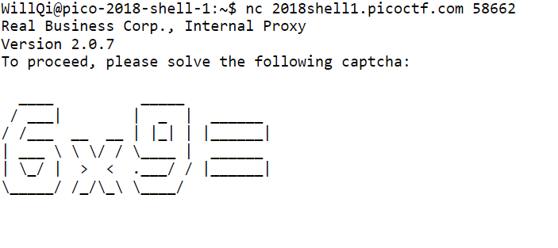

# Artisinal Handcrafted HTTP 3

**Points:** 300

**Description**
> We found a hidden flag server hiding behind a proxy, but the proxy has some... _interesting_ ideas of what qualifies someone to make HTTP requests. Looks like you'll have to do this one by hand. Try connecting via `nc 2018shell1.picoctf.com 58662`, and use the proxy to send HTTP requests to `flag.local`. We've also recovered a username and a password for you to use on the login page: `realbusinessuser`/`potoooooooo`.

**Hints**
> _Be the browser._ When you navigate to a page, how does your browser send HTTP requests? How does this change when you submit a form?

## Solution

Upon connecting to `2018shell1.picoctf.com:58662`, it brings up a math question we have to solve. This is most likely what the question says about the proxy having interesting ideas about what authenticates someone to send requests.


Upon solving it, we are prompted to create our HTTP request. We know the domain we have to look at is named `flag.local`, and that we have the username and password required to authenticate to it.

This is where the hint comes into play, how does our browser send HTTP requests? Below is an example of an HTTP request our browser could send.
```
GET / HTTP/1.1
Host: flag.local
Accept-Language: en-us
Accept-Encoding: gzip, deflate
Connection: Keep-Alive
```

However I found that you could alternatively just type into the prompt that appears instead of the above HTTP request.
```
GET /
Host: flag.local
```

If we type the above request into the prompt, it will return back the following HTML.
```html
<html>             
    <head>
        <link rel="stylesheet" type="text/css" href="main.css" />    
    </head>
    <body>
            <header>
                    <h1>Real Business Internal Flag Server</h1>
                    <a href="/login">Login</a>
            </header>
            <main>
                    <p>You need to log in before you can see today's flag.</p>
            </main>
    </body>
</html>
```

From this document we can see that we need to log in before we can see the flag. Let's send the same `GET` request but instead of `/`, we request `/login` to see how the login page looks like.

```
GET /login
Host: flag.local
```

We get the following document returned.
```html
<html>
    <head>
        <link rel="stylesheet" type="text/css" href="main.css" />
    </head>
    <body>
        <header>
            <h1>Real Business Internal Flag Server</h1>
            <a href="/login">Login</a>
        </header>
        <main>
            <h2>Log In</h2>

            <form method="POST" action="/login">
                <input type="text" name="user" placeholder="Username" />
                <input type="password" name="pass" placeholder="Password" />
                <input type="submit" />
            </form>
        </main>
    </body>
</html>
```

Ok, we'll need to send a `POST` request to `/login` to authenticate ourselves.

```
POST /login
Host: flag.local
Content-Length: 38
Content-Type: application/x-www-form-urlencoded

user=realbusinessuser&pass=potoooooooo
```

`Content-Length` is the length of the data we're sending to the server to authenticate ourselves.

`Content-Type` tells the server what data we're sending.

`user=realbusinessuser&pass=potoooooooo` is the data the form converts the `<input>`s to.

In response to the `POST` request, the server sends us the following.
```
HTTP/1.1 302 Found
x-powered-by: Express
set-cookie: real_business_token=PHNjcmlwdD5hbGVydCgid2F0Iik8L3NjcmlwdD4%3D; Path=/
location: /
vary: Accept
content-type: text/plain; charset=utf-8
content-length: 23
date: Mon, 15 Oct 2018 23:02:31 GMT
connection: close
```

The important part of this request is the `set-cookie` value, it's how the server knows who we are and what data it has stored for us. (e.g. confirmation that we have authenticated)

We just have to send one last `GET` request to `/` with our cookie as well in order to retrieve the flag.
```
GET /
Host: flag.local
Cookie: real_business_token=PHNjcmlwdD5hbGVydCgid2F0Iik8L3NjcmlwdD4%3D
```

The flag is `picoCTF{0nLY_Us3_n0N_GmO_xF3r_pR0tOcol5_a87a}`