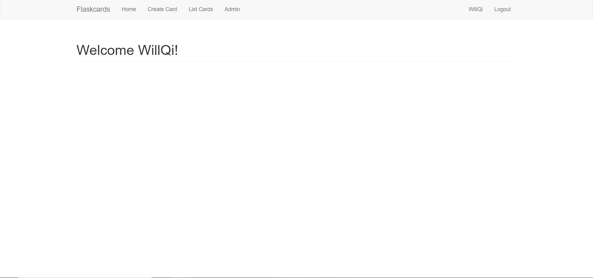
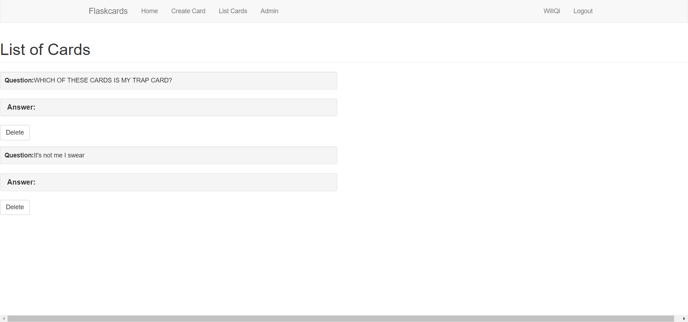
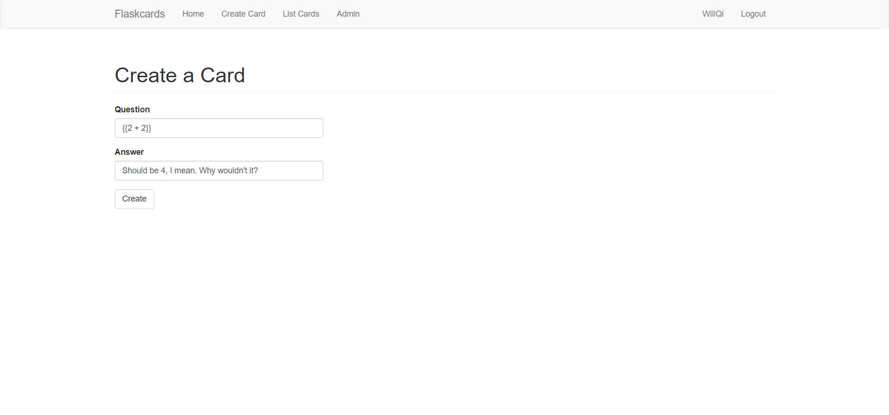
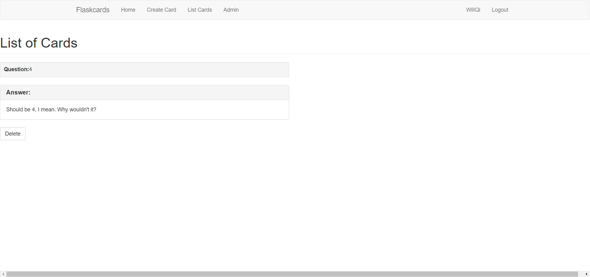
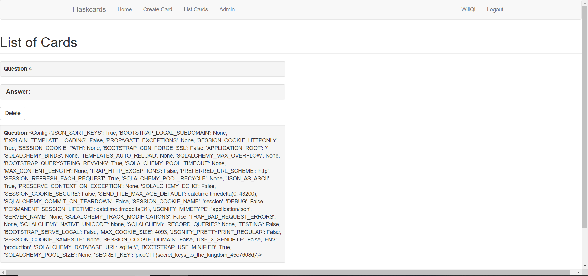

# Flaskcards

**Points:** 350

**Description**
> We found this fishy [website](http://2018shell1.picoctf.com:17991) for flashcards that we think may be sending secrets. Could you take a look?

**Hints**
> Are there any common vulnerabilities with the backend of the website?

> Is there anywhere that filtering doesn't get applied?

> The database gets reverted every 2 hours so your session might end unexpectedly. Just make another user

## Solution

When we goto the site, we're presented to a page that requires us to log in.

The login page is not vulnerable to SQL attacks, neither is the register page. If you create an account and login we are brought to the `/index` page. There are 4 tabs at the top. `Home`, `Create Card`, `List Cards`, and `Admin`.

Let's go ahead and create a card, when you create a card it will be displayed on the `List Cards` page.

Hmm, Flask is a python web framework. A common vulnerability with it is server-side template injection. In Flask, you can render templates, where you can also insert variables to replace placeholder information. You do this by `{{variable}}`. This website is vulnerable to this attack by parsing the user's input as a template. We can check by trying to create a card with a value `{{2 + 2}}`.

If it is vulnerable it will not output `{{2 + 2}}`, but rather `4`. (which it does as seen below)

We can use this to basically read any variable exposed to us. Flask applications have a configuration variable which could store valuable information we need. If we create a card with the value `{{config}}`, we get the response shown in the image.

We can see the flag is stored there, the flag is `picoCTF{secret_keys_to_the_kingdom_45e7608d}`