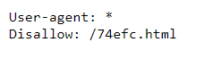

# Mr. Robots

**Points:** 200

**Description**
> Do you see the same things I see? The glimpses of the flag hidden away? `http://2018shell1.picoctf.com:29568` ([link](http://2018shell1.picoctf.com:29568))

**Hints**
> What part of the website could tell you where the creator doesn't want you to look?

## Solution

Websites can prevent web crawlers from viewing certain parts of the website through a `robots.txt` file. 

If we navigate to [/robots.txt](http://2018shell1.picoctf.com:29568/robots.txt), we can see the website administrator does not want any webcrawler to view [/74efc.html](http://2018shell1.picoctf.com:29568/74efc.html).

If you navigate to this webpage, you will find the flag is `picoCTF{th3_w0rld_1s_4_danger0us_pl4c3_3lli0t_74efc}`